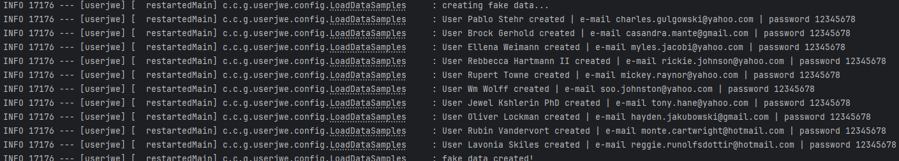
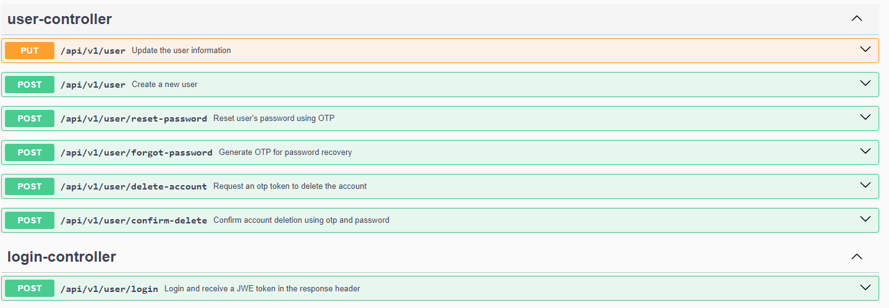

# Spring Boot User Registration and Authentication REST API

## A functional project example that uses Spring Security, JWE, TDD with JUnit and Spring MockMVC

Built as part of my studies on good architecture practices, this project provides a solid foundation for any Spring Boot REST API application.

## Development Features

- Test-Driven Development (TDD): Utilizes JUnit and Spring MockMVC for rigorous testing.
- Spring Security: Secures API endpoints.
- API Versioning: Managed through URI.
- Authentication Filter: Automatically extracts the JWE token from the request header to grant access to protected resources.
- JWE Token Management: Employs public and private key pairs for JSON Web Encryption.
- Password Encryption: Uses BCrypt to securely store hashed passwords in the database.
- Database Management: Basic setup with H2 database to store user information.
- Spring Data JPA: Facilitates database interactions.
- Spring Boot Actuator: Provides monitoring capabilities.
- Spring Boot DevTools: Enhances development speed.
- OpenAPI (Swagger): Documents API endpoints.
 

## How to run the project

### 1. Generate Encryption Key Pairs (Optional):
#### You can use the default key pairs provided or create your own.

- Create your private key
   - `openssl genpkey -algorithm RSA -out private_key.pem -pkeyopt rsa_keygen_bits:2048`
- Create your public key
  - `openssl rsa -pubout -in private_key.pem -out public_key.pem`
- Generate private key Base64 String
   - `less private_key.pem | tr -d '\n' >> private_key_base64.txt`
- Generate public key Base64 String
   - `less public_key.pem | tr -d '\n' >> public_key_base64.txt`

Overwrite the `key.private` and `key.public` properties in application.properties with the content of `private_key_base64.txt` and `public_key_base64.txt` respectively.

### 2. Run the project with maven

1. to start the project, use:
   1. `mvn spring-boot:run`
2. to run the project with preloaded fake data: 
   1. `mvn spring-boot:run -Dspring-boot.run.arguments=--userjwe.enablefakedata=true`
   2. When running this command the project will load 10 fake users into the database and print the user email and password in the console. 
     Then can be used to login in the endpoint `/users/login`
   3. 
3. to execute tests: 
   1. `mvn test`

### 3. API Enpoints 

The project provides seven endpoints:

There are just three that requires authentication:
 1. PUT `/users` - Update the user information
 2. POST `/users/delete-account` - Request an otp token to delete the account
 3. POST `/users/confirm-delete` - Confirm account deletion using otp and password

The other endpoints are public and can be accessed without authentication.

1. POST `/users` - Create a new user
3. POST `/users/login` - Login and receive a JWE token in the response header
4. POST `/users/forgot-password` - Request an OTP to reset the password
5. POST `/users/reset-password` - Reset the password using the OTP and a new password

#### When using the `/users/login` endpoint, the returned JWE token should be included in the request headers for any subsequent authenticated requests.

### 4. Access the Swagger UI
Visit the Swagger UI at [http://localhost:8080/swagger-ui/index.html](http://localhost:8080/swagger-ui/index.html) to explore the API documentation.

### Known issues

- Key Management: In this demo, the key pairs are stored in application.properties. In a production environment, they should be securely stored in a vault, keystore, or passed as arguments to the application.
- Unused Fields: The User entity includes secretPhrase and secretAnswer fields that are not utilized in this project but can be implemented for account recovery.
- Logging: Logging needs to be implemented in the project.

